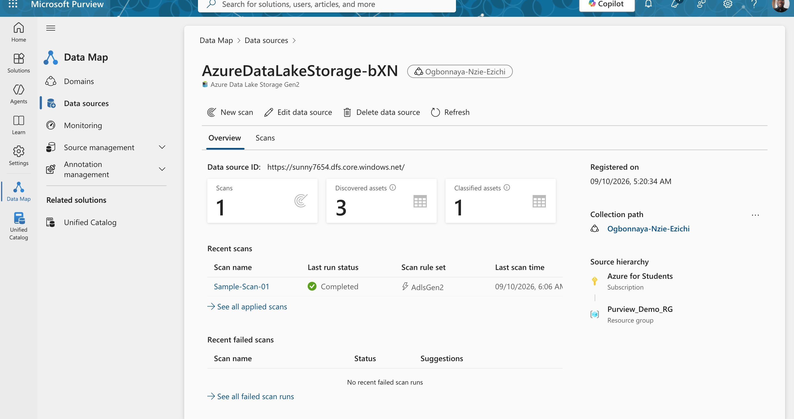
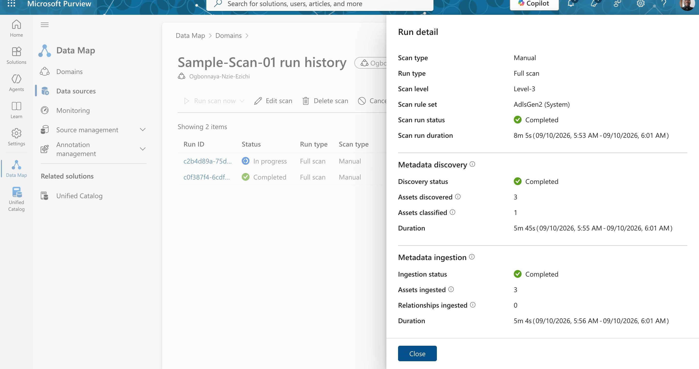
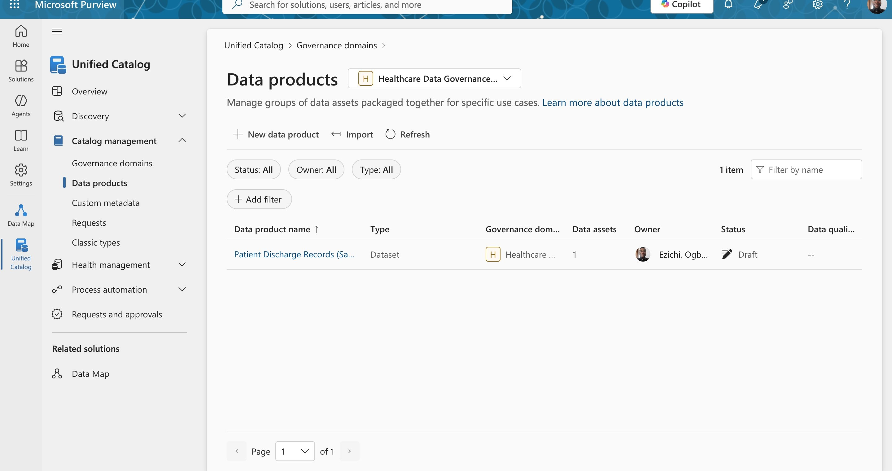
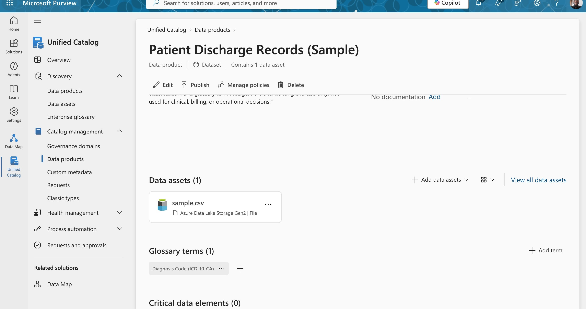
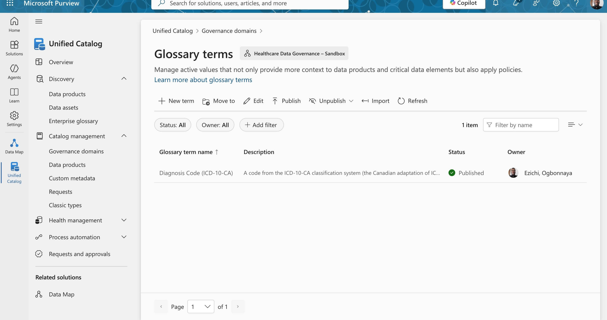
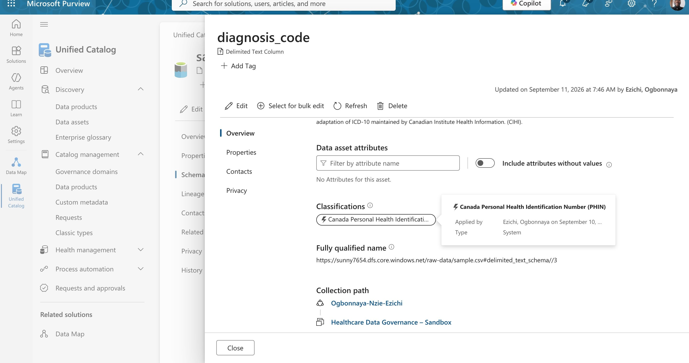
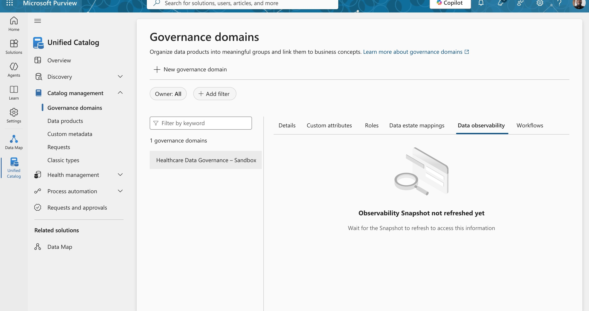
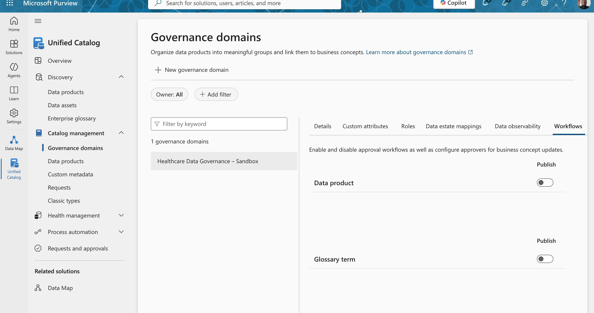

# Phase 1 — Microsoft Purview Data Governance Sandbox: A Case Study

**Author:** Ogbonnaya Nzie Ezichi
 
**Context:** Self-directed practice exercise, Microsoft Purview Unified Catalog, September 2026.

**Scope note:** Built entirely on placeholder/synthetic data (single-row sample patient discharge record). No real patient information (PHI) was used at any stage. This is explicitly a learning exercise, not a production governance implementation.

**Series note:** This is Phase 1 of a two-part exercise. Section 7 below identifies the need to repeat this against a realistic dataset — that's [Phase 2, built on real published CIHI hospitalization data](case-study-phase-2-real-cihi-data.md).

---

## 1. Objective

I wanted hands-on experience with Microsoft Purview's Unified Catalog. Specifically the relationship between technical metadata (schema, automated classification) and business metadata (glossary terms, data products, governance domains) using a healthcare-flavoured dataset relevant to the data governance roles I am targeting in Ontario. The goal was not to produce a finished governance program, but to understand how the pieces of Purview's object model actually connect, by building the chain end-to-end and documenting what broke along the way.

## 2. What Was Built

The final state is a small but complete governance chain:

| Layer | Object | Type / Status |
|---|---|---|
| Governance domain | `Healthcare Data Governance – Sandbox` | Type: Data domain · Status: Published |
| Data product | `Patient Discharge Records (Sample)` | Type: Dataset · Status: Draft |
| Data asset | `sample.csv` (ADLS Gen2 file, discovered via automated scan) | Contains: `patient_id`, `region`, `admission_date`, `diagnosis_code` |
| Glossary term | `Diagnosis Code (ICD-10-CA)` | Status: Published · Linked to the data product |
| Schema classification | `Canada Personal Health Identification Number (PHIN)` — auto-applied ("Type: System") to the `diagnosis_code` column | Likely a false positive — see Section 3, item 5 |

**Key architectural finding:** In this version of the Unified Catalog, glossary terms attach to **data products**, not directly to the schema/column level of a raw data asset. I initially assumed (incorrectly) that a business term like "Diagnosis Code" would link straight onto the `diagnosis_code` column. After several failed attempts, I confirmed that Purview's model is: **domain → data product → underlying technical asset**, with business context (glossary terms, descriptions) attaching at the product layer, while technical metadata (schema, automated classification) stays on the asset layer. This is a legitimate governance pattern, not a UI limitation. It separates "how the data is structured" from "what the data means to the business," which map to different owners in a real organization.

*Data Map: the registered source, with scan history and discovery/classification counts.*

*Sample-Scan-01 run detail, showing the metadata discovery and ingestion stages that produced the counts above.*

*The data product created in the Unified Catalog, still in Draft status (see Section 6, Open Items).*

*The completed chain: the data product with its one data asset and its one linked, published glossary term.*

## 3. Troubleshooting Narrative

This is arguably the more useful part of the exercise. Four separate obstacles came up in sequence, and each one taught me something about how Purview's governance objects actually behave, rather than how I assumed they would behave:

1. **Automated classification found nothing on the raw column.** Purview's built-in classifiers pattern-match against recognizable formats (SIN numbers, credit cards, emails). Dummy values like `1`, `ON`, `I50` don't match any known pattern, so nothing fired at the column level, even though a classification *did* later show up at the asset/schema level ("Canada Personal Health Identification…"). Lesson: automated classification coverage is not uniform across an asset's different metadata views, and "no classification" doesn't necessarily mean "no sensitive data". It can mean "the classifier didn't recognize this specific value shape." This is a real coverage gap worth noting in any process, not just this exercise.

2. **The glossary term wouldn't link to the asset column, and I initially misdiagnosed why.** My first hypothesis was a domain scoping mismatch — the asset lived in a different domain than the glossary term. I acted on that (moved the asset's domain association) before checking the more basic question: did the term actually exist? It turned out the term-creation wizard had never been carried through to a final "Create" step, so nothing had saved. Lesson: verify an object exists before diagnosing why it isn't visible downstream — a mistake I made and then had to backtrack from.

3. **Even after recreating the term, it still wouldn't link because it was sitting in Draft status.** Purview's Unified Catalog treats "Published" as a distinct governance gate: a term can be fully created, correctly described, and correctly scoped, and still be unusable for linking until explicitly published. This mirrors a real governance lifecycle — a steward proposes a term, but it isn't authoritative across the catalog until approved and published.

4. **After publishing the term, the column-level link *still* didn't work**, which is what led to the real discovery in Section 2: the link target was wrong all along. The fix wasn't a status change, it was creating a data product and linking the term there instead.

   
   *The term after publishing — the status gate described in item 3.*

5. **The auto-applied classification on `diagnosis_code` is very likely a false positive.** Purview tagged the column as `Canada Personal Health Identification Number (PHIN)` — a Microsoft built-in sensitive information type modeled on Manitoba's provincial health card number format. But `diagnosis_code` holds ICD-10-CA codes (e.g., "I50"), which identify a *medical condition*, not a *person*. The classifier most likely pattern-matched on the short alphanumeric shape of the sample value rather than the field's actual meaning. This is the inverse of the coverage gap noted in item 1: instead of missing real sensitive data because it didn't match a known pattern, the classifier over-applied a sensitive label to a field that isn't the kind of identifier it claims to be. Both failure modes — under- and over-classification — matter in a real governance program; the latter creates false confidence in a tag and can drive unnecessary access restrictions or alert fatigue if never reviewed by a human.

   
   *The classification tag on `diagnosis_code` referenced above — applied automatically by the system, not by a human reviewer.*

## 4. Skills This Demonstrates

- **Reading and correcting an incorrect mental model of a vendor's data architecture** distinguishing Data Map collections (technical, scan-scoped) from Unified Catalog governance domains (business-scoped), and identifying where business vs. technical metadata actually lives.
- **Methodical, evidence-based troubleshooting** under incomplete or inconsistent documentation (Purview's Unified Catalog is still in preview and its UI has known inconsistencies) including catching and correcting my own diagnostic misstep in step 2 above rather than continuing to build on a wrong assumption.
- **Understanding Draft/Published as a governance control**, not a cosmetic status encountered and correctly interpreted twice, on both a glossary term and (unexplained, still to confirm) the domain itself.
- **Judgment on manual classification and description authorship** as the necessary complement to automated scanning, since automated tools have real, demonstrable coverage gaps.
- **Critically evaluating automated classifier output rather than trusting it by default** catching a likely false-positive classification (a diagnosis code tagged as a personal health identification number) by reasoning about what the field actually represents versus what the classifier's pattern-matching produced.
- **Deliberate taxonomy decisions** e.g., choosing "Data domain" over "Regulatory" for the governance domain type, and "Dataset" over "Operational" for the data product type, with reasoning I can defend rather than a default click-through.

## 5. Known Limitations / What This Does *Not* Demonstrate

In the interest of not overstating this exercise: no role-based access control or data access policy was configured (Purview's "Manage policies" action was never explored). No data quality rules were set up. No lineage was explored. No approval workflow was actually built (I deliberately stepped around Purview's workflow setup to keep scope contained). Critical Data Elements and OKRs were not used. And — most importantly — the underlying data is a single placeholder row, not a realistic dataset, so classification behavior, glossary coverage, and data product structure were only ever tested against a toy case.

## 6. Open Items

- Decide how to handle the likely-false-positive PHIN classification on `diagnosis_code` — options include disputing/removing it if Purview supports that action, or leaving it in place with a documented note explaining the discrepancy for anyone reviewing the asset later. Either way, this shouldn't be left silently unaddressed.
- **Likely resolved, not fully confirmed:** the governance domain's status changed from Draft to Published shortly after I published the domain's first business concept (the `Diagnosis Code (ICD-10-CA)` glossary term). I checked two other possible explanations first — the domain's **Workflows** tab (approval workflows are disabled for Data Product/Glossary Term publishing here, which explains why those objects published instantly, but doesn't govern the domain object itself) and **Data observability** (empty; no audit trail available) — and found nothing there. The most plausible remaining explanation is a cascade rule: a domain may auto-transition out of Draft once it contains at least one published business concept. I have not found documentation confirming this rule explicitly, so I'm stating it as my best-supported hypothesis rather than a verified fact, and flagging that the sequence-of-events evidence (domain flipped immediately after the term's first publish) is what supports it.

  
  
  *The two tabs checked while investigating the domain's Draft → Published transition, referenced above.*

- Decide whether to publish the data product itself (currently Draft), which will require either adding a data access policy or explicitly setting up an approval workflow.

## 7. Next Steps

1. Repeat this exercise against a realistic **synthetic** dataset (e.g., Statistics Canada public health tables, CIHI public discharge summaries, or a Synthea-generated synthetic patient dataset) rather than a single placeholder row — this is necessary to properly test classification coverage and glossary behavior at any meaningful scale.
2. Add role-based access control and a data access policy to the data product, since access governance is typically more central to a real data governance role than glossary/taxonomy work.
3. Configure at least one data quality rule against the dataset, to round out the exercise beyond cataloging and into active governance.
