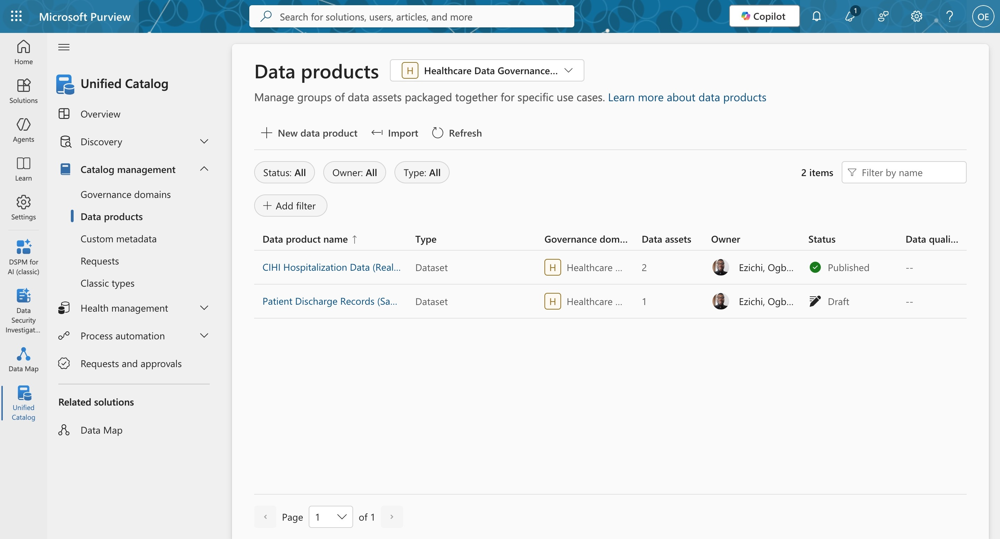
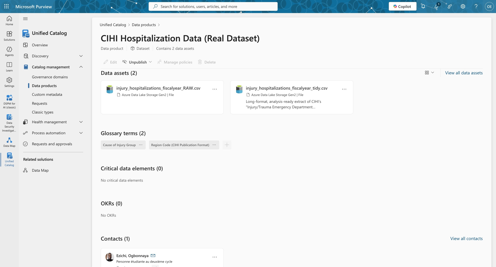
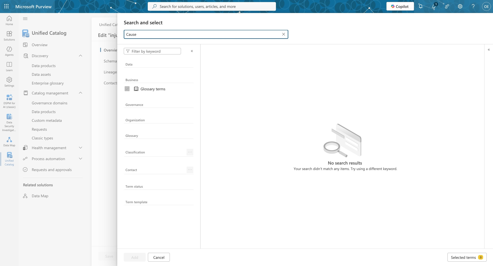

# Phase 2 — Microsoft Purview Data Governance Sandbox: Real CIHI Hospitalization Data

**Author:** Ogbonnaya Nzie Ezichi
**Context:** Self-directed practice exercise, Microsoft Purview Unified Catalog, September 2026
**Scope note:** Built on a real, publicly published Canadian Institute for Health Information (CIHI) table — aggregate injury/trauma hospitalization counts by cause and region. This is public, aggregate, statistical disclosure-controlled data with no patient-level records; it is not PHI. This is a learning exercise, not a production governance implementation.
**Continuity:** This is a direct follow-up to [Phase 1](case-study-phase-1-synthetic.md), an earlier sandbox exercise built on a single placeholder patient-discharge row. That exercise's stated next step was to repeat the workflow against a realistic dataset "at meaningful scale" — this is that repeat, using a real CIHI publication instead of synthetic data.

---

## 1. Objective

Phase 1 tested whether I understood Purview's object model (domain → data product → asset, with business metadata attaching at the product layer) against a toy, single-row dataset. The obvious gap was scale and realism: a placeholder row can't exercise a schema scanner, a classifier, or a suppression-handling decision the way a real published statistical table can.

Phase 2 sets out to do three things a single-row exercise couldn't:

1. Take a real government publication through a full raw-to-curated (bronze/silver) pipeline, with documented, defensible transformation decisions.
2. Register both layers in Purview and see what an automated schema scan actually does with a real, imperfectly-tabular CSV — not what I assumed it would do.
3. Author real business glossary content (not placeholder terms) and link it to the registered assets, documenting whatever breaks along the way with the same evidence-based rigor as Phase 1.

## 2. Data Source and Preparation

**Source:** Canadian Institute for Health Information (CIHI), Hospital Morbidity Database and Ontario Mental Health Reporting System, "Injury/Trauma Emergency Department Hospitalizations, 2024–2025," Table 1 — injury hospitalizations by cause-of-injury group and recipient province/territory.

The file as published is a formatted publication table, not an analysis-ready extract, and it surfaced four real data-quality issues before any Purview work started:

- **Encoding.** The source file is Mac OS Roman, not UTF-8. Read naively, every en dash in the title and the Notes/Sources block corrupts silently — no error is raised, which matters because a classifier or column-name match can fail the same way, without complaint.
- **Structure.** Row 1 is a title string, not a header — the real header is row 2. Row 40 is a grand-total row mixed into the same shape as the 39 cause-of-injury detail rows above it. Rows 42–48 are an embedded Notes/Sources block, reusing the same 17-comma-separated-field structure as the data rows, mostly empty. Nothing in the file format marks these as anything other than ordinary data rows.
- **Suppression.** 67 of 546 province/territory × cause-of-injury cells (12.3%) are marked `x` — CIHI's small-cell suppression for statistical disclosure control, not missing data. They're concentrated in the three territories and the Atlantic provinces. Coding these as `0` or dropping them would misstate the data; the suppression itself is a fact worth preserving.
- **Number formatting.** Values over 999 are quoted strings with thousands separators (`"1,097"`). Any column containing an `x` gets inferred as object dtype by a naive pandas read, which silently disables `thousands=','` parsing — comma-stripping has to be explicit, per cell.

**What was produced**, from the same source, for two different purposes:

- `injury_hospitalizations_fiscalyear_RAW.csv` — re-encoded to UTF-8 only; otherwise byte-for-byte the same structure CIHI published, title row, grand-total row, embedded footer and all. This is the faithful "as delivered" record.
- `injury_hospitalizations_fiscalyear_tidy.csv` — long-format, one row per cause-of-injury-group × region: `fiscal_year, cause_of_injury_group, region_code, region_name, hospitalizations, suppressed`. Title row, footer, and the grand-total row/column were excluded as derived aggregates, not source facts. Suppressed cells are `NULL` in `hospitalizations` with `suppressed = TRUE`, rather than `0` or the literal string `x`.

**Validation performed:** summed `hospitalizations` in the tidy file by region (excluding suppressed cells) and checked it against CIHI's own published Total row. All 14 regions reconciled exactly. This doesn't validate the suppressed cells themselves — there's no way to recover those from this file — but it confirms the reshape didn't drop or duplicate anything it could otherwise account for.

## 3. What Was Built

| Layer | Object | Status |
|---|---|---|
| Governance domain | `Healthcare Data Governance – Sandbox` | Published (reused from Phase 1) |
| Data assets | `injury_hospitalizations_fiscalyear_RAW.csv`, `injury_hospitalizations_fiscalyear_tidy.csv` (both ADLS Gen2, discovered via automated scan) | Registered, described |
| Glossary terms | `Cause of Injury Group`, `Region Code (CIHI Publication Format)` | Published |
| Data product | `CIHI Hospitalization Data (Real Dataset)` | Published, bundling both assets and both terms |

Both glossary terms carry real definitions, not placeholders: `Cause of Injury Group` documents that it maps to a specific ICD-10-CA external-cause-of-injury code range (e.g., Accidental poisoning = X40–X49), and is a coarser grouping than the underlying code — it describes a circumstance, not a person. `Region Code (CIHI Publication Format)` documents that CIHI's abbreviations (`N.L.`, `Que.`, `B.C.`) follow Canada Post's mailing convention, not a formal StatCan or ISO 3166-2:CA code list — worth flagging explicitly, since nothing about the values themselves signals that to a downstream classifier or join.

*The data product from this phase (top row), Published with 2 data assets — shown next to Phase 1's product, still in Draft.*

*The completed chain for this phase: both CIHI assets (RAW and tidy) and both authored glossary terms, linked at the data-product layer.*

## 4. Troubleshooting Narrative

Three real obstacles came up, in sequence. Each one is a genuine platform behavior I hadn't seen documented anywhere, diagnosed the same way: form a hypothesis, gather evidence that could disprove it, and only act once the evidence pointed one way.

### 4.1 Resource Set misdetection silently broke schema parsing

The first upload used the literal year range in the filename (`injury_hospitalizations_2024-2025_RAW.csv`). Purview's Data Map has a "Resource Set" heuristic: filenames containing digit runs that look like they could partition a dataset (dates, IDs, batch numbers) get pattern-matched and templated — `2024-2025` became `{N}`. This is meant for genuinely partitioned data (e.g., `sales_2024.csv`, `sales_2025.csv`, one schema across many files), and it fired on a filename that merely contained a year range, not an actual partition series.

The effect wasn't a visible error — it was silent downstream damage: schema parsing and classification never ran cleanly against the templated pattern, so the registered asset never exposed real column names or picked up classification, regardless of the file's actual content.

**Fix:** removed every digit from both filenames entirely (`fiscalyear` in place of the literal year range) and re-uploaded clean. Verified directly: the tidy asset's schema now shows real column names (`fiscal_year`, `cause_of_injury_group`, `region_code`, `region_name`, `hospitalizations`, `suppressed`) instead of the templated placeholder.

**Lesson:** a scanner's heuristics can silently defeat governance goals (accurate schema, working classification) with no error surfaced anywhere in the UI. The only way I found this was by comparing what I expected the schema to show against what was actually registered — not by anything Purview flagged.

### 4.2 The RAW asset's schema limitation is a documented trade-off, not a bug to chase

Even after the resource-set fix, the RAW asset's automated schema scan shows generic `:csv/0`…`:csv/16` columns instead of real names. This is because Purview's scanner assumes row 1 is the header, and the RAW file's row 1 is CIHI's title text by design — that's the entire point of keeping a faithful, unmodified raw layer.

I considered stripping the title row to satisfy the scanner, and decided against it: doing so would defeat the reason the RAW asset is registered separately from the tidy one in the first place — to preserve exactly what CIHI published, for lineage and audit purposes. Instead, this is documented explicitly in the asset's own description as a known, intentional limitation: schema-complete, classifier-visible cataloging is handled at the curated (tidy) layer; the raw layer is scanned for existence, lineage, and access control, not column-level schema.

**Lesson:** not every scanner limitation is worth engineering around. The right call depends on what the asset is *for* — a raw/bronze layer's job is fidelity to source, not machine-readability, and a governance program should be able to say so explicitly rather than quietly working around it.

### 4.3 Asset-level glossary-term linking is broken in this preview UI — diagnosed, then routed around at the data-product layer

This was the substantial one. Linking either glossary term to either asset via the asset's own Edit form → Glossary terms → Search-and-select consistently returned "No search results," for every query tried.

Before treating this as unfixable, I gathered evidence to rule out the explanations that would actually be fixable:

- **Draft status?** No — opened the term directly; its detail panel shows `Status: Published`, created and last updated the same session.
- **Indexing lag for a freshly created term?** No — the same empty result came back for a completely unrelated term (`Diagnosis Code`) that had existed since the Phase 1 exercise, days earlier.
- **A narrow or malformed query?** No — a bare single-letter query (`a`), which should match nearly every term in a three-term glossary, also returned zero results.
- **Session- or browser-specific?** No — reproduced independently in the user's own separate Chrome session, not just in the automated browser driving this exercise.
- **A permissions or backend error masked as an empty result?** Attempted to confirm via network inspection, and hit a genuine tooling wall: the picker's traffic lives entirely inside a cross-origin iframe (`catalog.prod.ext.web.purview.azure.com`) that neither the accessibility tree nor the network/console inspector could see into from outside. This ruled out further diagnosis by that route, but didn't change the conclusion — every other test pointed at a real, reproducible defect in this specific picker component, not a transient or environmental cause.

*The defect itself: searching "Cause" — a substring of an existing, Published term's own name — from the asset's Edit → Glossary terms picker returns nothing.*

With the direct route confirmed broken, I looked for a different Purview mechanism that reaches the same governance outcome — a business term conceptually linked to a technical asset — through a different code path. Purview's **Data Products** feature turned out to be exactly that: a data product bundles technical assets and glossary terms together for a stated use case, and its own "Add data assets" search-and-select dialog is a *different* component with a working search index (confirmed live: searching "fiscalyear" returned the correct assets immediately).

I used the data product created in the original draft (already linked to both glossary terms from earlier setup) as the bundling point, added both new, correctly-named assets to it, removed the two old resource-set-misdetected duplicates once the clean assets were confirmed, and published it. The result: `Cause of Injury Group` and `Region Code (CIHI Publication Format)` are now linked, via the data product, to `injury_hospitalizations_fiscalyear_tidy.csv` and `injury_hospitalizations_fiscalyear_RAW.csv`. This is a legitimate governance construct, not a workaround that fakes the outcome — Purview's own model already treats "business term ↔ data product ↔ underlying asset" as a first-class relationship (this is the same domain → data product → asset pattern identified in Phase 1). The asset-level picker's defect remains open and undocumented as a platform bug; the governance objective it was meant to serve was met through a supported alternate path.

**Lesson:** when a specific control in a platform is broken, the fix isn't always "make that control work" — it's understanding the platform's object model well enough to know whether a different, equally legitimate path reaches the same governed outcome. That requires actually knowing the model, not just clicking through the first UI you're offered.

## 5. Skills This Demonstrates

- Diagnosing real, undocumented platform data-quality artifacts (encoding, title-row/header mismatch, embedded footer, statistical suppression) directly from a raw government publication, and making — and justifying — the calls needed to turn it into an analysis-ready extract without losing information (suppression flags, not zeros; no silent double-counting from an unremoved total row).
- Root-causing a silent platform failure (resource-set misdetection) by comparing expected versus actual schema output, rather than trusting the absence of an error message.
- Distinguishing a genuine platform limitation worth documenting (RAW asset's header assumption) from a genuine platform defect worth working around (the glossary-linking picker) — and treating them differently rather than reflexively "fixing" both.
- Evidence-based bug diagnosis under ambiguity: systematically ruling out draft status, indexing lag, query specificity, and session-specific causes before concluding a defect was structural, and being explicit about which diagnostic route (network-level inspection) was blocked and why.
- Working within a vendor's actual object model — recognizing that Purview treats business-term linkage as a data-product-level relationship, and using that correctly rather than forcing a workaround at the wrong layer.
- Judgment on when to stop debugging a symptom and re-scope toward the underlying governance objective.

## 6. Known Limitations / What This Does *Not* Demonstrate

The asset-level Glossary terms picker's root cause is still not confirmed at the platform-internals level (only that it's reproducibly broken) — this would need Microsoft support access or the classic Atlas API to confirm definitively, neither of which was in scope here. No data quality rules, lineage exploration, or Critical Data Elements were configured in this phase. Access policy configuration for the data product was completed only at the minimum needed to publish (access management explicitly disabled, since this sandbox has no real subscriber workflow) — a production access policy would need real approvers and a genuine time-limited access model, not a placeholder.

## 7. Open Items

- File the asset-level glossary-linking defect as product feedback to Microsoft, since it's reproducible and evidenced — the reproduction steps above (single-letter query against a days-old published term) would let Microsoft's team confirm it quickly.
- Revisit the asset-level linking periodically — if it's a genuine defect rather than a design limitation, it may be fixed in a future preview build; the data-product-level linking already in place should stay regardless.

## 8. Next Steps

1. Configure a real data quality rule against the tidy asset (e.g., regional totals reconcile to CIHI's published Total row, or suppressed-cell proportion falls within an expected range) — data quality scoring was never exercised in either phase.
2. Extend the two-phase pattern (synthetic toy case, then a real published dataset) to a dataset large enough to exercise Purview's lineage view meaningfully — neither phase has touched lineage yet.
3. Revisit role-based access control on the data product with a real (even if still fictional) approver and audience model, rather than the disabled-access-management default used to unblock publishing here.
